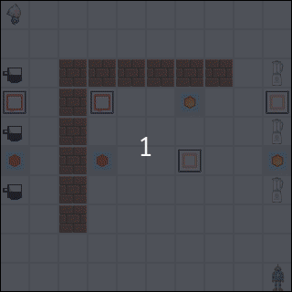

# Juiced

Juiced is an open-source environment for testing out cooperative reinforcement learning algorithm.



## Installation

To install Juiced, clone this repository and install the dependencies. The following script assumes you are using `dnf`
for your package manager.

```bash
# clone repository
git clone https://github.com/trust-game/juiced
cd juiced

# install dependencies
pip install numpy
```

## Adding custom entities

Juiced is written in a way to allow easy addition of custom entities. This brief tutorial shall walk you through the
steps to create a custom `RubberDuck` in Juiced.

### Step 1: Identifying suitable type

There are two main type of entities in Juiced: `Carriable` and `Interactable`.

`Carriable` are entities that can be carried by a character. Example includes apple and cup. On the other hand,
`Interactable` are entities that can be interacted by a character. Example includes storage and juicer. Note that by
design, an entity can only be either `Carriable` or `Interactable` but not both.

In our example, we shall model `RubberDuck` as a `Carriable`.

### Step 2: Add entity class

After identify the type, open the respective code and add the entity as a new class. In our example, we shall add the
following code snippet into `carriable.py`.

```python
class RubberDuck(Carriable):
    def __init__(self):
        is_quackable = False
```

### Step 3: Initialize entity

To add your custom entity onto stage, you need to modify the `_initialize_entities` method in `stage.py`. You can use
the `configuration` parameter to determine the initial position of your entities. In our example, we shall add the
following code snippet into the method. Note that we are allowing for multiple `RubberDuck` to be added onto the stage.

```python
for rubber_duck_position in configuration["rubber_ducks"]:
    self.add(Wall(), rubber_duck_position[0], rubber_duck_position[1])
```

### Step 4: Add metadata entry

To facilitate the generation of GUI and state representation, you have to add and register a metadata entry in
`metadata.py`. To add a metadata entry, add the following line in the `__init__` method. Note that the index of the
metadata must be unique.

```python
self.meta_rubber_duck = Metadata(41, "images/misc/rubber_duck.png")
```

Now add this line of code into `get_metadata` method to indicate which entity should be associated with this metadata.

```python
# bunch of if-else
elif isinstance(entity, RubberDuck):
    return self.meta_rubber_duck
# bunch of if-else
```

### Step 5: Add your image file

Finally, add your image file into the `images` directory and you are done :tada::tada::tada: 
